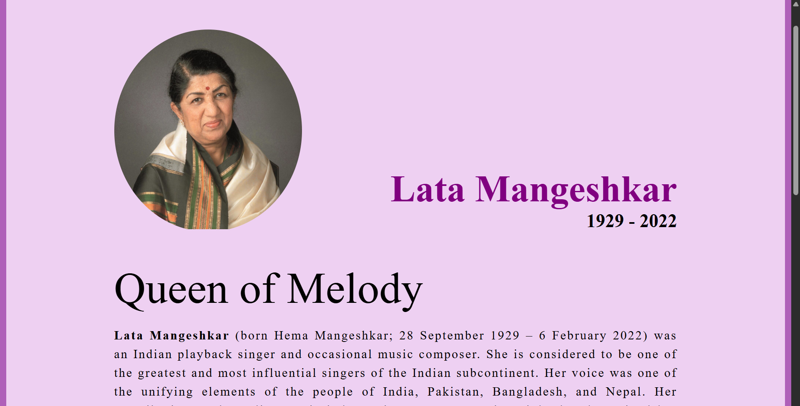

# tribute-website

# Tribute Page

A responsive tribute page built with HTML and CSS to honor and celebrate the life and achievements of *Lata Mangeshkar*.

## 🌟 Features

- **Responsive Design**: Optimized for all device sizes (mobile, tablet, desktop)
- **Clean Layout**: Modern and elegant design with smooth scrolling
- **Interactive Elements**: Hover effects and smooth animations
- **Accessible**: Built with accessibility best practices in mind
- **Fast Loading**: Optimized images and minimal dependencies

## 🖼️ Preview



*Screenshot of the tribute page displaying the main hero section and timeline*

## 🚀 Live Demo

[View Live Demo](https://ankitathorve.github.io/tribute-website/)

## 🛠️ Technologies Used

- **HTML5**: Semantic markup structure
- **CSS3**: Styling, animations, and responsive design

## 📁 Project Structure

```
tribute-page/
├── index.html
├── css/
├── lata-ji.jpg
└── README.md
```

## 🎯 Sections Included

1. **Hero Section**: Main portrait and introduction
2. **Biography**: Life story and background
3. **Timeline**: Key milestones and achievements
4. **Gallery**: Photo collection
5. **Quotes**: Memorable sayings and wisdom
6. **Legacy**: Impact and influence
7. **Footer**: Additional resources and links

## 🚀 Getting Started

### Prerequisites

- A modern web browser
- Basic understanding of HTML/CSS (for customization)

### Installation

1. Clone the repository:
   ```bash
   git clone https://github.com/ankitaThorve/tribute-page.git
   ```

2. Navigate to the project directory:
   ```bash
   cd tribute-page
   ```

3. Open `index.html` in your web browser or serve it using a local server:
   ```bash
   
   # Using Node.js (with http-server installed globally)
   http-server
   ```

4. Visit `http://localhost:8000` in your browser

## 🎨 Customization

### Changing the Subject

1. Replace images in the `assets/images/` directory
2. Update the content in `index.html`
3. Modify colors and styling in `css/styles.css`

/*### Color Scheme

The main colors can be modified in the CSS custom properties:

```css
: root {
  --primary-color: #2c3e50;
  --secondary-color: #3498db;
  --accent-color: #e74c3c;
  --text-color: #333;
  --border-color: rgb(175, 96, 185);
  --background-color: rgb(238, 208, 242);
}
```
*/

### Adding New Sections

1. Add HTML structure in `index.html`
2. Style the new section in `css/styles.css`

## 📱 Responsive Breakpoints

- **Mobile**: 320px - 768px
- **Tablet**: 769px - 1024px
- **Desktop**: 1025px and above

## ♿ Accessibility Features

- Semantic HTML structure
- Alt text for all images
- Proper heading hierarchy
- Keyboard navigation support
- Screen reader friendly
- High contrast ratios

## 🤝 Contributing

Contributions are welcome! Here's how you can help:

1. Fork the repository
2. Create a feature branch (`git checkout -b feature/AmazingFeature`)
3. Commit your changes (`git commit -m 'Add some AmazingFeature'`)
4. Push to the branch (`git push origin feature/AmazingFeature`)
5. Open a Pull Request

### Guidelines

- Follow existing code style and conventions
- Test your changes across different browsers and devices
- Update documentation if needed
- Ensure accessibility standards are maintained

## 🙏 Acknowledgments

- Tribute for their inspiring life and contributions
- Contributors and supporters

## 📞 Contact

**Ankita Thorve**
- GitHub: [@ankitaThorve](https://github.com/ankitaThorve)
- Email: ankietathorve@gmail.com
- LinkedIn: [Ankita Thorve](www.linkedin.com/in/ankita-thorve)

## 📊 Project Stats


---

⭐ **Star this repository if you found it helpful!**

*Built with ❤️ as a tribute to Lata Mangeshkar*
